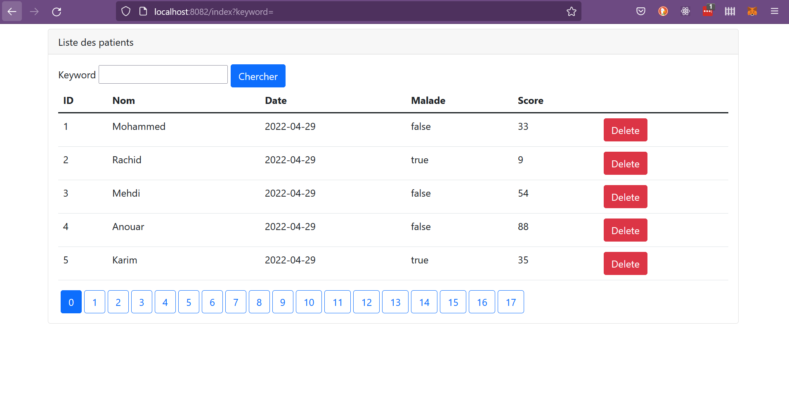

<h1><strong> Creation d'une application Web de gestion d'une liste des patients. </strong></h1>

<h2> Technologies utilisées : Spring MVC, Thymeleaf, Spring Data, MySQL.</h2>

<h3> Première partie de notre création de notre Web App. </h3>
  <ul>
    <li>Recherche patients</li>
    <li>Pagination</li>
    <li>Suppression</li>
  </ul>

