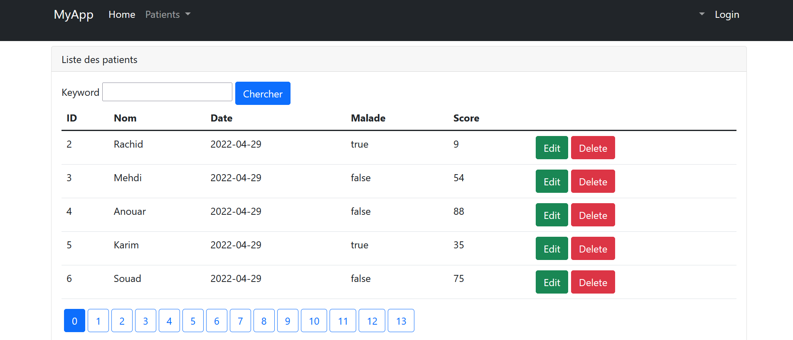

<h1><strong> Creation d'une application Web de gestion d'une liste des patients. </strong></h1>

<h3> Deuxième partie de notre création de notre Web App. </h3>

  <ul>
    <li>Add layout</li>
 
      
      
  
  
    <li>Ajout d'un nouveau patient</li>
  
      
      
      

  
    <li>Modification des informations d'un patient</li>
  
      
      
      

  </ul>
